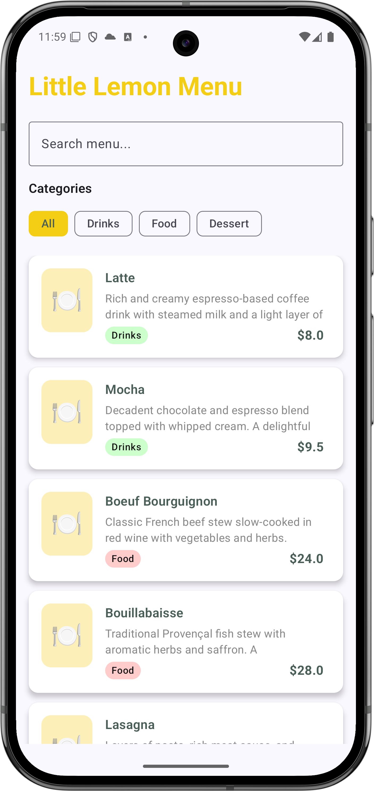
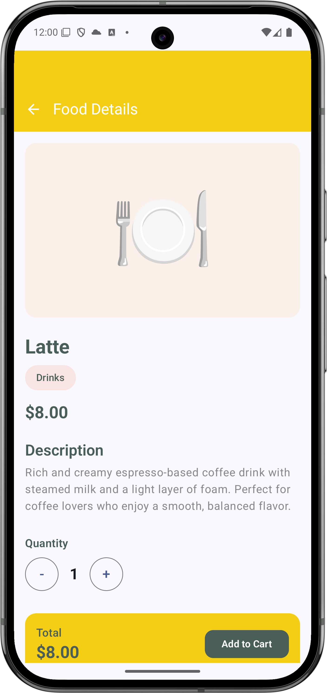
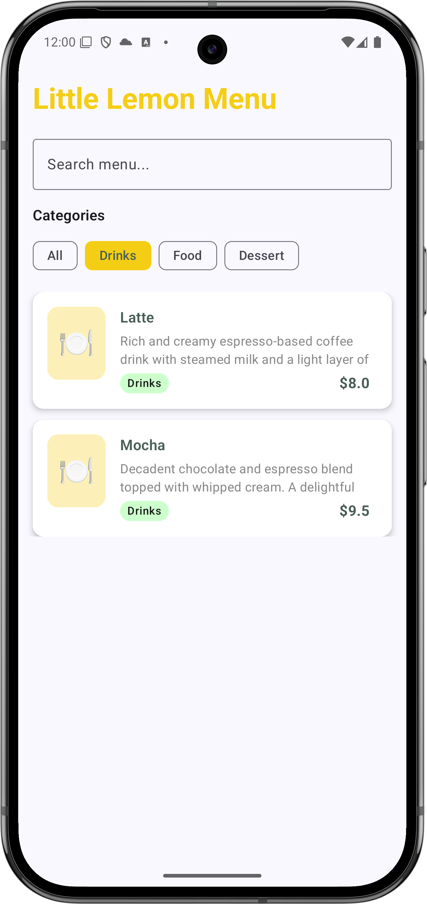
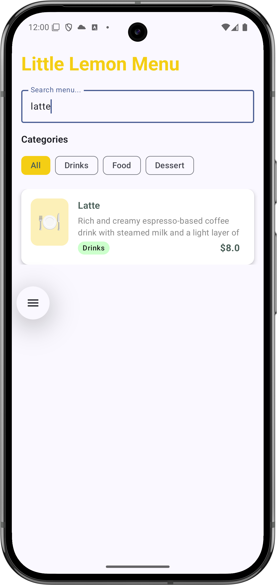

# Little Lemon Food App

A simple Android food menu app built with Jetpack Compose, featuring a home screen with food listings and detailed food views.

  <table>
    <tr><th colspan="2">📱 Screen Previews</th></tr>
<tr>
      <td align="center"> Home Screen</td>
      <td align="center"> Food Detail</td>
    </tr>

<tr>
      <td align="center"> Category Filter</td>
      <td align="center"> Search</td>
</tr>
  </table>

## Features

### Home Screen

- **Food List**: Display all available menu items
- **Search Functionality**: Search foods by name or description
- **Category Filtering**: Filter foods by category (Drinks, Food, Dessert)
- **Category Chips**: Easy category selection with visual feedback
- **Food Cards**: Clean card layout showing food image placeholder, name, description, category, and price

### Food Detail Screen

- **Detailed View**: Full food information with large image placeholder
- **Quantity Selection**: Increase/decrease quantity with buttons
- **Price Calculation**: Real-time total price calculation based on quantity
- **Category Badge**: Visual category indicator
- **Add to Cart**: Ready for cart integration
- **Back Navigation**: Return to home screen

## Architecture

### Data Layer

- **Food Model**: Data class representing food items with id, name, description, price, category, and image URL
- **FoodCategory Enum**: Categorizes foods into Drinks, Food, and Dessert
- **FoodData Object**: Contains sample data and utility functions for data access

### UI Layer

- **HomeScreen**: Main screen displaying food list with search and filtering
- **FoodDetailScreen**: Detailed view of individual food items
- **Components**: Reusable UI components like buttons and image placeholders
- **Navigation**: Simple navigation state management between screens

### Theme

- **Little Lemon Colors**: Brand-specific color palette
  - Yellow: `#F4CE14`
  - Green: `#495E57`
  - Orange: `#EE9972`
  - Pink: `#FBDABB`

## Sample Data

The app includes 10 sample food items across three categories:

- **Drinks**: Latte, Mocha
- **Food**: Boeuf Bourguignon, Bouillabaisse, Lasagna, Onion Soup, Salmon en Papillote, Quiche Lorraine
- **Dessert**: Custard Tart, Croissant

## Key Components

### Models

- `Food.kt`: Data models and sample data
- `FoodCategory`: Enum for food categorization

### Screens

- `HomeScreen.kt`: Main food listing with search and filters
- `FoodDetailScreen.kt`: Individual food details and quantity selection

### Navigation

- `Navigation.kt`: Simple navigation state management

### Components

- `LittleLemonComponents.kt`: Reusable UI components

## Usage

1. **Browse Menu**: View all available food items on the home screen
2. **Search**: Use the search bar to find specific items
3. **Filter**: Select category chips to filter by food type
4. **View Details**: Tap any food item to see detailed information
5. **Adjust Quantity**: Use +/- buttons to select desired quantity
6. **Add to Cart**: Ready for future cart implementation

## Future Enhancements

- Real image loading with Coil or Glide
- Cart functionality
- User authentication
- Order placement
- Real API integration
- Favorites system
- Reviews and ratings
